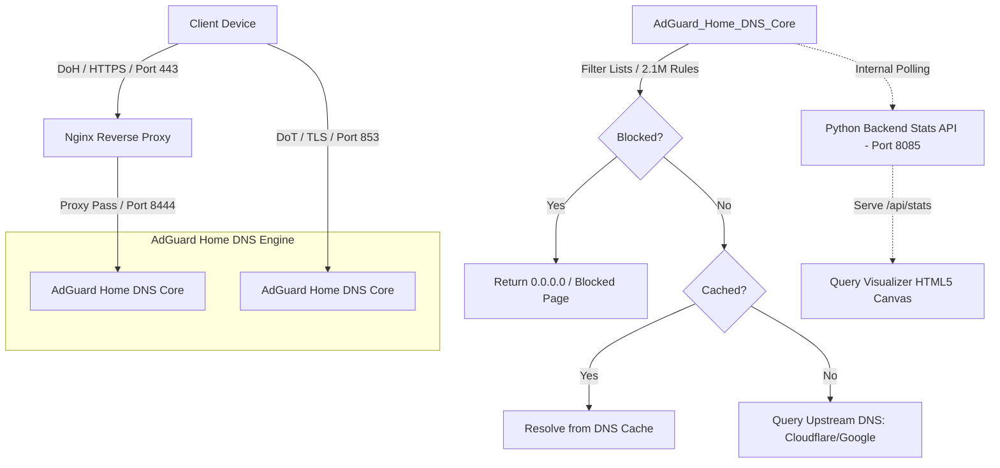
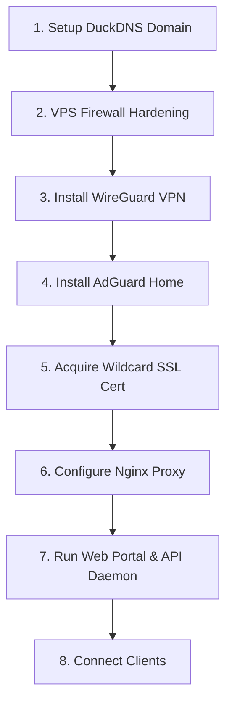

# Private Secure Encrypted DNS & Ad-Blocking Server

A complete guide and codebase to build your own private, high-performance, secure DNS server featuring **DNS-over-HTTPS (DoH)**, **DNS-over-TLS (DoT)**, **WireGuard VPN**, and **AdGuard Home** ad-blocking. This repository includes a custom real-time query visualizer web portal with live animated particle flows and a Python backend stats API.

---

## 📂 Repository Directory Structure

```text
├── apple-profiles/
│   └── dns.mobileconfig       # Configuration profile template for iOS / macOS
├── scripts/
│   ├── duckdns_update.sh      # Dynamic IP updates updater script for DuckDNS
│   ├── certbot_auth.sh        # Certbot DNS-01 auth hook script
│   └── certbot_cleanup.sh     # Certbot DNS-01 cleanup hook script
├── templates/
│   ├── nginx-default.conf     # Nginx reverse proxy configuration template
│   └── dnsmalik-stats.service # systemd stats-api daemon service config template
├── stats_api.py               # Backend statistics and query resolution Python API
├── RealTime.html              # Frontend Query Visualizer Dashboard (HTML5 Canvas)
├── index.html                 # Main Web Portal Home page
├── faq.html                   # Frequently Asked Questions page
├── privacy.html               # Personal privacy policy page
├── status.html                # Operational status page
├── contact.html               # Support and contact page
└── README.md                  # This complete documentation guide
```

---

## 📊 System Architecture & Traffic Flow

### 1. Conceptual Flow (ASCII Map)

```text
                   ┌──────────────────────────────────────────┐
                   │               Client Device              │
                   └─────────────────────┬────────────────────┘
                                         │
                 DoH (HTTPS / Port 443)  │  DoT (TLS / Port 853)
                 ┌───────────────────────┴───────────────────────┐
                 ▼                                               ▼
     ┌───────────────────────┐                       ┌───────────────────────┐
     │ Nginx Reverse Proxy   │                       │  AdGuard Home DoT     │
     │   (Port 443 / SSL)    │                       │     (Port 853)        │
     └───────────┬───────────┘                       └───────────┬───────────┘
                 │ Proxy Pass to                                 │
                 │ AdGuard DoH (Port 8444)                       │
                 ▼                                               │
     ┌───────────────────────────────────────────────────────────▼───────────┐
     │                     AdGuard Home DNS Core                             │
     │    (Filters queries, blocks ads/malware, cache hits resolution)       │
     └───────────┬───────────────────────────────────────────────┬───────────┘
                 │                                               │
                 │ Query Details (UDP/TCP)                       │ Resolves Clean Domain
                 ▼                                               ▼
     ┌────────────────────────┐                      ┌───────────────────────┐
     │  Python Stats API      │                      │  Upstream DNS Core    │
     │      (Port 8085)       │                      │  (Cloudflare/Google)  │
     └───────────┬────────────┘                      └───────────────────────┘
                 │ Serves stats over /api/stats
                 ▼
     ┌────────────────────────┐
     │ RealTime Web Dashboard │
     │  (Canvas flow system)  │
     └────────────────────────┘
```

### 2. Detailed Logical Diagram (Mermaid)



---

## 🔒 Port Configuration & Interfaces

| Service / Port | Protocol | Interface Binding | Public Status | Security / Purpose |
| :--- | :--- | :--- | :--- | :--- |
| **Port 53 (UDP/TCP)** | Plain DNS | `127.0.0.1`, `10.66.66.1` | **BLOCKED** | Secured via firewall to prevent open resolver DDoS abuse. Only accessible via local/VPN. |
| **Port 853 (UDP/TCP)** | DoT / DoQ | `127.0.0.1`, `10.66.66.1`, Public IP | **OPEN** | Accessible on the public network. Used for Android Private DNS. |
| **Port 8444 (TCP)** | HTTPS / DoH | `127.0.0.1`, `10.66.66.1` | **BLOCKED** | AdGuard Home backend HTTPS/DoH server. Protected behind Nginx. |
| **Port 443 (TCP)** | DoH Proxy | `0.0.0.0` | **OPEN** | Nginx proxies standard DoH `/dns-query` requests to internal port 8444. |

---

## 🗺️ Deployment Roadmap



---

## 🛠️ Step-by-Step Installation Guide

### Step 1: Free Domain Setup via DuckDNS.org

To support secure encryption (DoH/DoT), you need a domain name to bind your SSL certificates. DuckDNS provides free domains with dynamic IP update support.

1. Go to [DuckDNS.org](https://www.duckdns.org/) and log in.
2. Create a subdomain (e.g., `yourdomain`).
3. Add your VPS public IPv4 address (`A` record) and public IPv6 address (`AAAA` record) if available.
4. **Auto-Update Script:** 
   * Copy the template script in `/scripts/duckdns_update.sh` to `/etc/duckdns/duck.sh` on your VPS.
   * Edit `/etc/duckdns/duck.sh` to input your personal subdomain name and DuckDNS token.
   * Make it executable and configure a cron job to run it every 5 minutes:
     ```bash
     sudo chmod 700 /etc/duckdns/duck.sh
     crontab -e
     # Add the following line:
     */5 * * * * /etc/duckdns/duck.sh >/dev/null 2>&1
     ```

---

### Step 2: VPS Firewall & Network Hardening

To prevent your DNS server from being abused in Open Resolver DDoS amplification attacks, public access to standard **Port 53 (UDP/TCP)** must be blocked, while keeping **Port 443 (DoH)** and **Port 853 (DoT)** open.

#### 1. Cloud Infrastructure Ingress Rules (Security Lists / Security Groups)
Add the following Ingress rules in your Cloud Server's firewall settings:
* **TCP Port 22 / 2222** (SSH Management)
* **TCP Port 80** (HTTP - required for Let's Encrypt verification)
* **TCP Port 443** (HTTPS - DNS-over-HTTPS)
* **TCP & UDP Port 853** (DNS-over-TLS / DNS-over-QUIC)
* **UDP Port 51820** (WireGuard VPN)

#### 2. Host Firewall (UFW / iptables) Configuration
Run the following commands on your Ubuntu VPS to secure Port 53 and allow encrypted protocols:
```bash
# Allow standard SSH and WireGuard VPN
sudo ufw allow 22/tcp
sudo ufw allow 2222/tcp
sudo ufw allow 51820/udp

# Allow HTTP and HTTPS (DoH)
sudo ufw allow 80/tcp
sudo ufw allow 443/tcp

# Allow DNS-over-TLS (DoT)
sudo ufw allow 853/tcp
sudo ufw allow 853/udp

# Block public DNS Port 53 (but allow it on local interfaces and VPN)
sudo ufw route reject proto udp to any port 53
sudo ufw route reject proto tcp to any port 53
sudo ufw allow in on lo to any port 53
sudo ufw allow in on wg0 to any port 53

# Enable Firewall
sudo ufw enable
```

---

### Step 3: Install & Configure WireGuard

WireGuard lets you connect to the server securely for management purposes (like viewing the AdGuard Home Admin UI).

1. Install WireGuard:
   ```bash
   sudo apt update && sudo apt install -y wireguard
   ```
2. Generate private and public keys:
   ```bash
   wg genkey | tee /etc/wireguard/server_private.key | wg pubkey > /etc/wireguard/server_public.key
   ```
3. Create `/etc/wireguard/wg0.conf`:
   ```ini
   [Interface]
   PrivateKey = SERVER_PRIVATE_KEY
   Address = 10.66.66.1/24
   ListenPort = 51820
   
   # IP Forwarding rules
   PostUp = iptables -A FORWARD -i wg0 -j ACCEPT; iptables -t nat -A POSTROUTING -o enp0s6 -j MASQUERADE
   PostDown = iptables -D FORWARD -i wg0 -j ACCEPT; iptables -t nat -D POSTROUTING -o enp0s6 -j MASQUERADE
   ```
4. Enable IP forwarding in `/etc/sysctl.conf`:
   ```bash
   sudo sed -i 's/#net.ipv4.ip_forward=1/net.ipv4.ip_forward=1/g' /etc/sysctl.conf
   sudo sysctl -p
   ```
5. Start and enable WireGuard:
   ```bash
   sudo systemctl enable --now wg-quick@wg0
   ```

---

### Step 4: Install AdGuard Home

AdGuard Home acts as the filtering DNS core engine.

1. Install AdGuard Home via the official automated script:
   ```bash
   curl -s -S -L https://raw.githubusercontent.com/AdguardTeam/AdGuardHome/master/scripts/install.sh | sh
   ```
2. Open the AdGuard setup wizard by visiting `http://10.66.66.1:3000` via your WireGuard connection.
3. Configure the settings:
   * **Admin Web Interface:** Bind to `10.66.66.1` on port `80`.
   * **DNS Server:** Bind to `127.0.0.1`, `10.66.66.1`, and your public IPv4/IPv6 addresses on port `53`.
4. In the AdGuard Dashboard, go to **Settings ➔ Encryption Settings**:
   * Enable encryption.
   * Server Name: `yourdomain.duckdns.org`
   * Bind the **DNS-over-TLS** server to port `853`.
   * Bind the **DNS-over-HTTPS** server to port `8444`.
   * Provide the paths to your SSL certificates (configured in Step 5).

---

### Step 5: Acquire a Wildcard SSL Certificate (Certbot)

A wildcard SSL certificate allows you to use client identifiers (e.g., `musab.yourdomain.duckdns.org`) dynamically. These are authenticated under the same certificate and parsed into separate client logs inside AdGuard Home!

1. Copy the authenticator and cleanup hooks from `/scripts/certbot_auth.sh` and `/scripts/certbot_cleanup.sh` to `/etc/letsencrypt/` on your VPS.
2. Edit both files to insert your personal DuckDNS subdomain and token.
3. Make both scripts executable:
   ```bash
   sudo chmod +x /etc/letsencrypt/certbot_auth.sh /etc/letsencrypt/certbot_cleanup.sh
   ```
4. Run Certbot to issue the wildcard certificate:
   ```bash
   sudo certbot certonly --manual --preferred-challenges=dns \
     --manual-auth-hook /etc/letsencrypt/certbot_auth.sh \
     --manual-cleanup-hook /etc/letsencrypt/certbot_cleanup.sh \
     -d "yourdomain.duckdns.org" -d "*.yourdomain.duckdns.org"
   ```

---

### Step 6: Nginx Reverse Proxy Configuration

Nginx hosts our visualizer web files and proxies public incoming `/dns-query` (DoH) requests on port `443` to AdGuard Home's internal HTTP server running on port `8444`.

1. Install Nginx:
   ```bash
   sudo apt install -y nginx
   ```
2. Copy the configuration provided in `templates/nginx-default.conf` into `/etc/nginx/sites-available/default` on your server.
3. Check config and reload Nginx:
   ```bash
   sudo nginx -t && sudo systemctl reload nginx
   ```

---

### Step 7: Web Portal & Python Stats API Deployment

The visualizer frontend relies on a lightweight Python daemon that polls AdGuard Home statistics locally and presents them via a secure API.

1. **Deploy Frontend Web Portal:**
   * Move all the `.html` files (`index.html`, `RealTime.html`, `faq.html`, etc.) and `.png` assets in this repository to `/var/www/html/`.
   * Set permissions:
     ```bash
     sudo chown -R www-data:www-data /var/www/html/
     sudo chmod -R 644 /var/www/html/*
     ```
2. **Deploy Backend Python API:**
   * Copy the `stats_api.py` script to `/usr/local/bin/dnsmalik_stats_api.py` on the server.
   * Copy the systemd service file template `templates/dnsmalik-stats.service` to `/etc/systemd/system/dnsmalik-stats.service`.
   * **Set Credentials securely:** Edit `/etc/systemd/system/dnsmalik-stats.service` and insert your actual AdGuard username, password, IP bindings under the `Environment` lines. This avoids leaving credentials in the repository code:
     ```ini
     Environment="AGH_HOST=10.66.66.1:8082"
     Environment="AGH_USER=your_username"
     Environment="AGH_PASS=your_password"
     Environment="DNS_RESOLVER_IP=10.66.66.1"
     ```
   * Start and enable the backend daemon:
     ```bash
     sudo systemctl daemon-reload
     sudo systemctl enable --now dnsmalik-stats.service
     ```

---

### Step 8: Client Devices Setup Guide

Once the server is running, configure your client devices to use secure, encrypted DNS.

#### 1. Android (DoT - Port 853)
Android natively supports **DNS-over-TLS (DoT)** via the "Private DNS" setting. You can enter **any custom prefix** to identify your device in the logs.
1. Open your Android device **Settings** ➔ **Network & Internet** ➔ **Private DNS**.
2. Select **Private DNS provider hostname**.
3. Enter your custom hostname (e.g. `phone.yourdomain.duckdns.org`).
4. Tap **Save**.

#### 2. Windows 11 (DoH - Port 443)
Windows 11 supports native **DNS-over-HTTPS (DoH)** templates.
1. Open **Settings** ➔ **Network & internet** ➔ Select **Wi-Fi** or **Ethernet** ➔ click **Edit** next to **DNS server assignment** (set to **Manual**, toggle **IPv4** to **On**).
2. **Preferred DNS:** Type your DNS server's raw IPv4 address (do not enter the HTTPS url here).
3. **DNS over HTTPS:** Change the dropdown menu from *Off* to **On (manual template)**.
4. **DNS over HTTPS template:** Paste your secure DoH URL:
   `https://windows.yourdomain.duckdns.org/dns-query`
5. **Fall-back to plaintext:** Set this to **Off**.
6. Click **Save**.

#### 3. macOS / iOS (DoH/DoT Profile)
Apple devices require a Configuration Profile (`.mobileconfig`) to be installed for encrypted DNS.
* A pre-configured profile is located in this repository at `apple-profiles/dns.mobileconfig`.
* Download this file, replace the placeholder URL with your domain, and install it on macOS (double-click to install in System Settings ➔ Profiles) or iOS (install via Settings ➔ Profile Downloaded).
